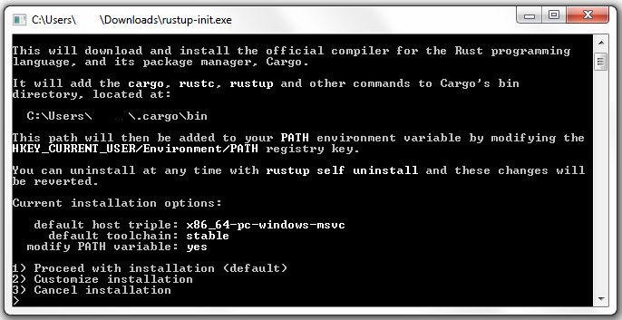
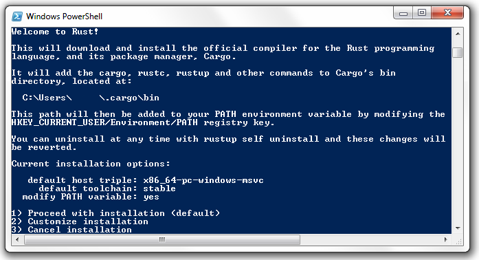

## Rust Windows Install

[Regular install](#how-to-install-rust-on-windows) | [Behind a proxy install](#how-to-install-rust-on-windows-behind-a-proxy)

### How to install Rust on Windows

The recommended installation method for Windows is through the [RUSTUP-INIT.EXE tool](https://www.rust-lang.org/tools/install).

The setup will first ask if you want to customize the intallation. Selection the default values by selecting "1".



If you run into the following errors you might be behid a proxy: "could not download file (...)", "error during download", "Couldn't resolve host name". See the next section for details.


### How to install Rust on Windows behind a proxy

If you are behind a proxy, first download the [RUSTUP-INIT.EXE tool](https://www.rust-lang.org/tools/install) from the official Rust site.

Now, before executing the tool you must configure the proxy in a **PowerShell** instance:

```powershell
> $proxy='http://<IP>:<PORT>'
```

Depending on your network configuration you will have to specify your domain, user and password:
```powershell
> $proxy='http://<DOMAIN>%5C<USER>:<PASSWORD>@<IP>:<PORT>'
```
Note that ```%5C``` is the code for backslash.
Finally update the ENV variable and execute the tool:
```powershell
> $ENV:HTTP_PROXY=$proxy 
> $ENV:HTTPS_PROXY=$proxy
> .\rustup-init.exe
```



Now you can proceed with as a regular installation.
